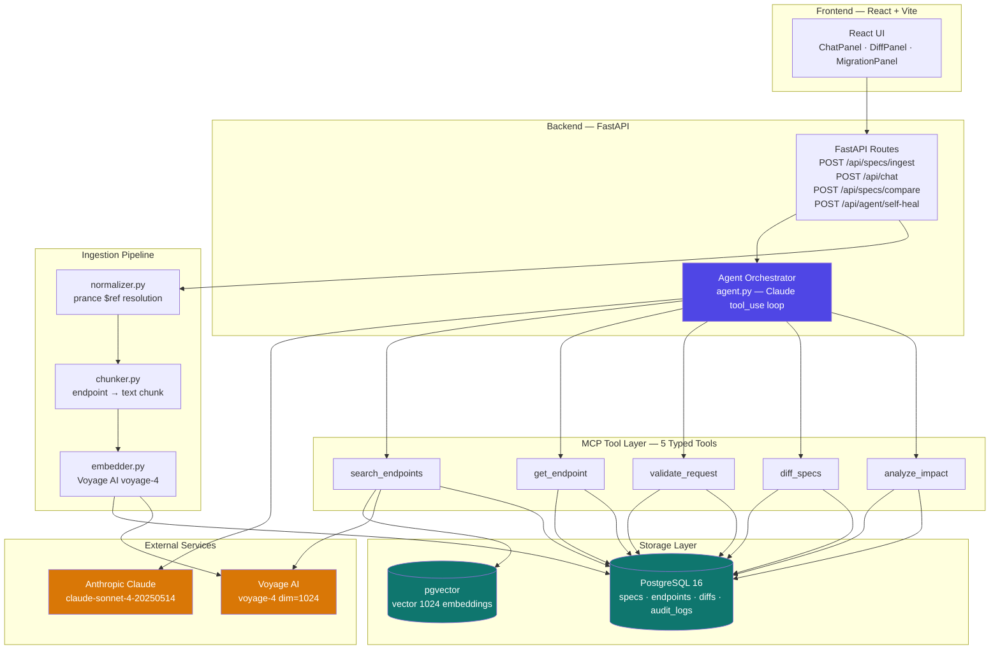
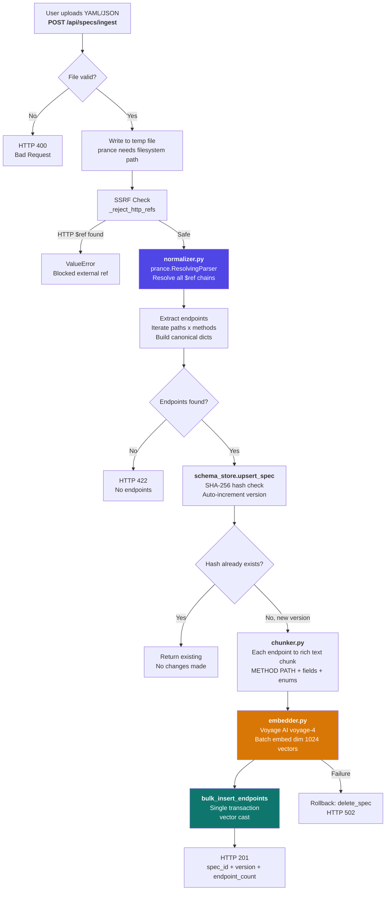
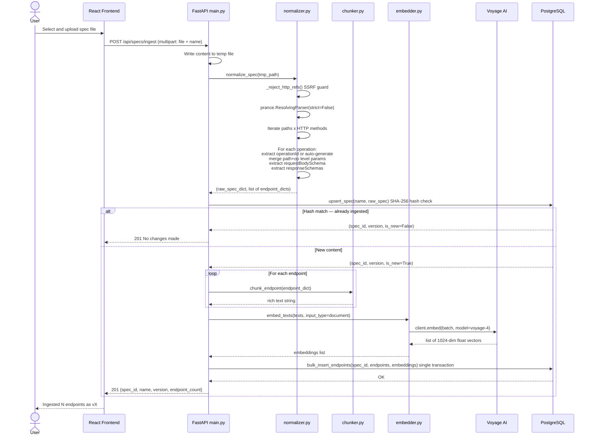
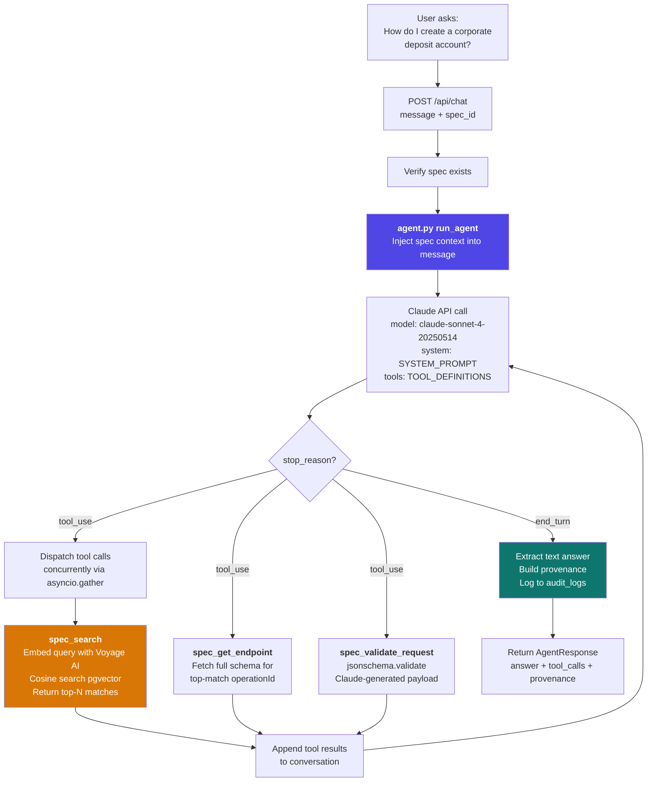
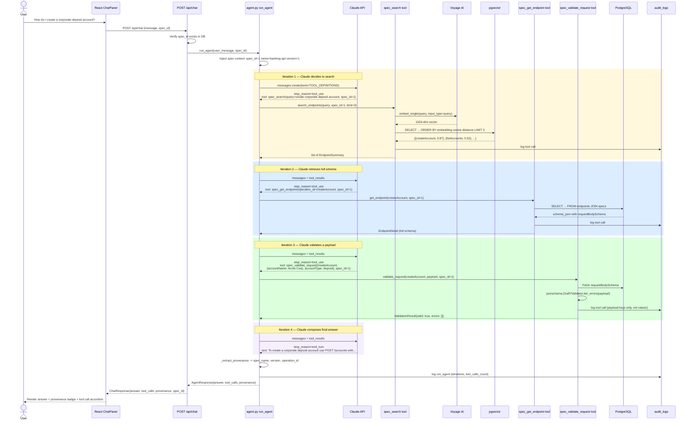
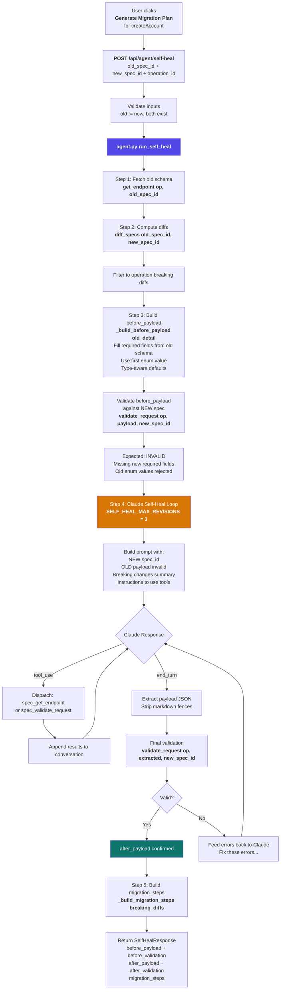
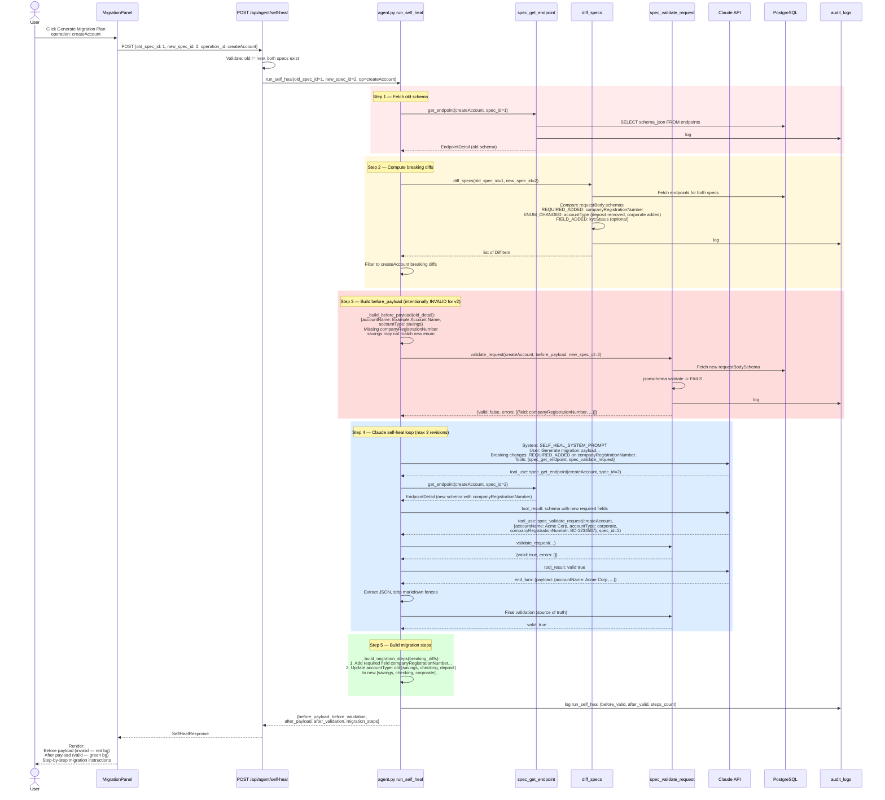
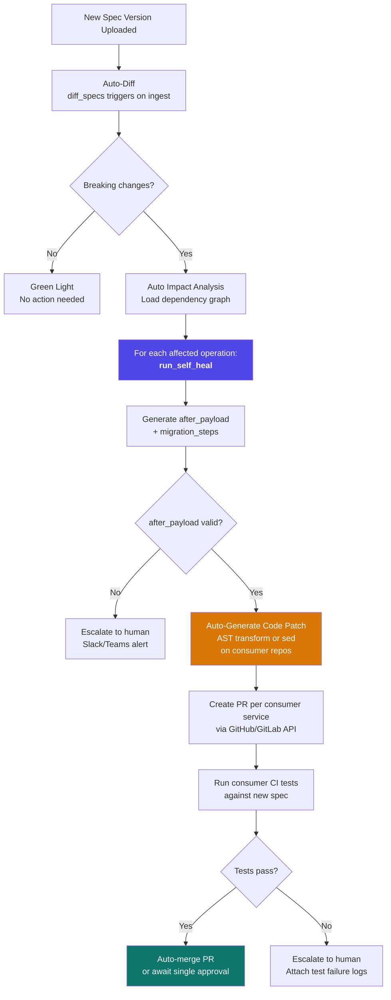
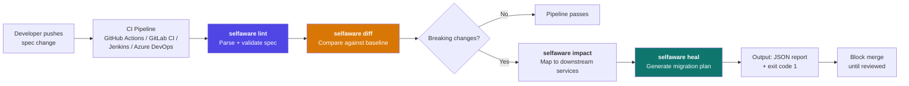
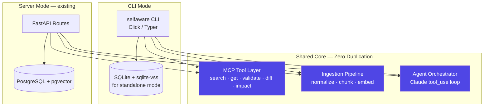

# Self-Aware API Platform — Detailed Code Walkthrough

> A technical deep-dive into the three core flows: **Ingest**, **Query**, and **Self-Heal**.
> Includes Mermaid diagrams, code references, and a forward-looking viewpoint on full automation and CI/CD integration.

---

## Table of Contents

1. [Architecture Overview](#1-architecture-overview)
2. [Flow 1 — Spec Ingestion](#2-flow-1--spec-ingestion)
3. [Flow 2 — Query (Discover & Validate)](#3-flow-2--query-discover--validate)
4. [Flow 3 — Self-Heal (Migration Generation)](#4-flow-3--self-heal-migration-generation)
5. [Viewpoint — Fully Automated Self-Heal Propagation](#5-viewpoint--fully-automated-self-heal-propagation)
6. [Viewpoint — CLI & CI/CD Pipeline Integration](#6-viewpoint--cli--cicd-pipeline-integration)

---

## 1. Architecture Overview

The platform is a **tool-first, agent-mediated** system. The LLM (Claude) never touches the database directly — every action flows through a typed MCP tool, and every tool call is logged to `audit_logs`.



### Database Schema (Quick Reference)

| Table | Purpose | Key Columns |
|---|---|---|
| `specs` | One row per ingested spec version | `id`, `name`, `version`, `spec_json` (JSONB), `hash` |
| `endpoints` | One row per operation with embedding | `spec_id`, `operation_id`, `method`, `path`, `schema_json`, `embedding` vector(1024) |
| `diffs` | Stored diff between two spec versions | `spec_id_old`, `spec_id_new`, `diff_json` (JSONB), `breaking_count` |
| `audit_logs` | Every MCP tool call | `tool_name`, `inputs`, `outputs`, `duration_ms` |

---

## 2. Flow 1 — Spec Ingestion

### What happens when you upload an OpenAPI spec

The ingestion pipeline transforms a raw YAML/JSON OpenAPI spec into **normalized endpoint dicts**, **1024-dim vector embeddings**, and **Postgres rows** — making every endpoint semantically searchable.

### Mermaid Flow Diagram



### Sequence Diagram



### Code Walkthrough — Key Functions

#### 1. `normalizer.py` → `normalize_spec(spec_path)`
- **SSRF protection**: `_reject_http_refs()` scans the raw file content for `$ref: http://` patterns before parsing. Blocks external references to prevent Server-Side Request Forgery.
- **Full $ref resolution**: `prance.ResolvingParser` recursively resolves all `$ref` chains (`#/components/schemas/...`, local file refs) into inline JSON.
- **Canonical extraction**: For every `(path, method)` pair, builds a dict with `operation_id`, `method`, `path`, `summary`, `tags`, `parameters`, `request_body_schema`, `response_schemas`, and the full `schema_json`.
- **Parameter merging**: `_merge_parameters()` merges path-level and operation-level parameters, with operation-level winning on `(name, in)` key collisions.

#### 2. `chunker.py` → `chunk_endpoint(endpoint_dict)`
Converts a canonical endpoint dict into a rich text string designed for high-quality semantic embedding:
```
POST /accounts
operationId: createAccount
summary: Create a new bank account
tags: accounts
requestBody fields: accountName (string, required); accountType (string, required, enum: savings, checking, deposit)
response 201 fields: id, accountName, accountType, status, createdAt
```
This structured text ensures that vector similarity search works on **method + path + field names + enum values** — not just summaries.

#### 3. `embedder.py` → `embed_texts(texts, input_type)`
- Thread-safe lazy client initialization (double-checked locking).
- Batches texts in groups of 50 (Voyage AI limit is 128, capped for safety).
- Uses `input_type="document"` for stored content, `input_type="query"` for search queries — this asymmetric embedding improves retrieval accuracy.

#### 4. `schema_store.py` → `upsert_spec()` + `bulk_insert_endpoints()`
- **Idempotent ingestion**: SHA-256 hash of `json.dumps(spec_json, sort_keys=True)`. Same content = same hash = skip re-embedding.
- **Auto-versioning**: `COALESCE(MAX(version), 0) + 1` per spec name. Retries once on `UNIQUE(name, version)` race condition.
- **Atomic insert**: `bulk_insert_endpoints` uses a single `executemany()` + `commit()`. On failure, the orphaned spec row is cleaned up.

---

## 3. Flow 2 — Query (Discover & Validate)

### What happens when a user asks "How do I create a corporate deposit account?"

The query flow uses a **Claude tool_use agent loop** — Claude decides which tools to call, processes the results, and synthesises a grounded answer with provenance.

### Mermaid Flow Diagram



### Sequence Diagram



### Code Walkthrough — Key Mechanics

#### Agent Loop (`agent.py` → `run_agent()`)
- **Max 10 iterations**: Hard guard. Raises `RuntimeError` if exceeded.
- **Concurrent tool dispatch**: When Claude returns multiple `tool_use` blocks in a single response, they are dispatched concurrently via `asyncio.gather()`.
- **Token-efficient**: `max_tokens=1024` (chat answers are concise). `response_schemas` stripped from `spec_get_endpoint` results to save input tokens. Search `limit` capped at 3.
- **Provenance extraction**: After the loop, `_extract_provenance()` scans tool call history — prefers `spec_get_endpoint` inputs for `operation_id`, falls back to first `spec_search` result.

#### Vector Search (`spec_search.py` → `search_endpoints()`)
- Embeds the query with `input_type="query"` (asymmetric retrieval).
- pgvector cosine distance: `1 - (embedding <=> %s::vector) AS score`.
- Results sorted by distance ascending (best match first), score = `1 - distance`.

#### Validation (`spec_validate.py` → `validate_request()`)
- Uses `jsonschema.Draft7Validator.iter_errors()` — single pass, collects **all** errors at once.
- Each error gets a structured `hint` based on `validator` type (required, enum, type, pattern, minLength, etc.).
- **Security**: Only `payload.keys()` are logged — never the values (which may contain PII).

#### Audit Trail
Every tool call logs to `audit_logs` in its `finally` block — ensuring logging even on failure:
```
tool_name | inputs (sanitized) | outputs (summary) | spec_id | duration_ms | created_at
```

---

## 4. Flow 3 — Self-Heal (Migration Generation)

### What happens when you click "Generate Migration Plan"

The self-heal flow detects breaking changes between two spec versions, builds a **before payload** (valid for v1, invalid for v2), uses a **Claude tool_use loop** to generate a valid **after payload** for v2, and returns step-by-step migration instructions.

### Mermaid Flow Diagram



### Sequence Diagram



### Code Walkthrough — Key Mechanics

#### `_build_before_payload(old_detail)` — Intentional Invalidity
Constructs a payload that is **valid for the old spec but will FAIL against the new spec**:
- Fills only the old `required` fields.
- For enum fields, uses the **first** enum value (e.g. `"savings"`) — which may have been removed in v2.
- The contrast between red (before) and green (after) in the UI makes breaking changes viscerally obvious.

#### Claude Self-Heal Loop — Constrained Generation
- **Separate system prompt** (`SELF_HEAL_SYSTEM_PROMPT`): Instructs Claude to ONLY return `{"payload": {...}}` — no prose, no markdown.
- **Reduced tool set** (`SELF_HEAL_TOOLS`): Only `spec_get_endpoint` + `spec_validate_request`. No search tool — the operation is already known.
- **Max 3 revisions** (`SELF_HEAL_MAX_REVISIONS`): If Claude can't produce a valid payload in 3 tries, the system raises `RuntimeError` rather than burning tokens.
- **Double validation**: Even when Claude claims it validated via a tool call, `run_self_heal()` always does a **final validation itself** before accepting the payload.

#### `_build_migration_steps(breaking_diffs)` — Human-Readable Instructions
Maps each `DiffItem.change_type` to a natural-language migration instruction:

| Change Type | Example Step |
|---|---|
| `REQUIRED_ADDED` | "Add required field 'companyRegistrationNumber' to all requests for POST /accounts" |
| `ENUM_CHANGED` | "Update 'accountType': old [savings, checking, deposit] → new [savings, checking, corporate]" |
| `FIELD_REMOVED` | "Remove 'legacyField' from payloads — no longer exists in new spec" |
| `TYPE_CHANGED` | "Change type of 'amount' from string to number" |
| `ENDPOINT_REMOVED` | "Remove all client calls to DELETE /accounts/{id}" |

#### Diff Engine (`spec_diff.py` → `diff_specs()`)
Compares `requestBody` schemas field-by-field:
1. **REQUIRED_ADDED** — field newly appears in `required[]` → BREAKING
2. **FIELD_REMOVED** — field dropped from `properties{}` → BREAKING
3. **TYPE_CHANGED** — same field, different `type` → BREAKING
4. **ENUM_CHANGED** — values removed from `enum[]` → BREAKING; values only added → NON_BREAKING
5. **FIELD_ADDED** — new optional field → NON_BREAKING
6. **ENDPOINT_REMOVED** — entire operation gone → BREAKING

Diffs are persisted to the `diffs` table and reused by `analyze_impact()`.

#### Impact Analysis (`impact_analyze.py` → `analyze_impact()`)
- Loads `specs/dependencies.yaml` — a service dependency graph mapping `operationId` → `[{service, team, severity}]`.
- Cross-references breaking diffs with downstream consumers.
- Returns `ImpactItem` records: which services, which teams, what severity.

---

## 5. Viewpoint — Fully Automated Self-Heal Propagation

### Current State: Human-in-the-Loop

Today, the self-heal flow generates a **migration plan** (before/after payloads + instructions) and presents it for human review. The developer decides whether to apply it. This is the right default for a 48-hour build — trust must be earned.

### Vision: Closed-Loop Automated Propagation

The architecture is already designed to support full automation with minimal extension:



### What Needs to Be Built

| Capability | Implementation Path |
|---|---|
| **Auto-diff on ingest** | Add a post-ingest hook in `main.py`: after `bulk_insert_endpoints`, check if a previous version exists. If so, call `diff_specs()` automatically. |
| **Event bus** | Introduce a lightweight event system (even just a Postgres `LISTEN/NOTIFY` channel) to decouple ingest from diff/heal triggers. |
| **Code patch generation** | Extend Claude's self-heal prompt to output not just a JSON payload but an actual code diff (e.g., Python `requests.post()` call, Java DTO class). Use the consumer's language context from `dependencies.yaml`. |
| **PR automation** | Integrate GitHub/GitLab API: create a branch, commit the generated patch, open a PR tagged with the diff_id and audit trail link. |
| **Consumer test gate** | Trigger the consumer's CI pipeline against the PR. If tests pass, auto-merge (or require one-click approval). If tests fail, escalate with full context. |
| **Rollback safety** | Every auto-generated PR links back to the `audit_logs` entry. If a propagated change causes production issues, the audit trail provides instant root cause: which diff triggered which heal which generated which patch. |

### Key Principle: Progressive Trust

```
Level 0: Detect + Report          ← Today (diff + impact panel)
Level 1: Detect + Suggest Fix     ← Today (self-heal with human review)
Level 2: Detect + Fix + PR        ← Auto-PR with CI gate
Level 3: Detect + Fix + Merge     ← Full automation with rollback safety
```

Each level is a configuration toggle, not a code rewrite. The MCP tool layer and audit trail remain unchanged — only the **orchestration policy** changes.

---

## 6. Viewpoint — CLI & CI/CD Pipeline Integration

### The Problem

The platform currently runs as a web application. But the real value for engineering teams is **shift-left** — catching breaking changes **before** they're merged, not after they're deployed.

### Vision: `selfaware` CLI

A lightweight CLI that wraps the same backend tools, designed to run in any CI/CD pipeline:



### Proposed CLI Commands

```bash
# Ingest a spec into the platform (or local SQLite in standalone mode)
selfaware ingest ./specs/banking-api-v2.yaml --name banking-api

# Diff against the previous version (or a specific baseline)
selfaware diff --old banking-api:v1 --new banking-api:v2 --format json
selfaware diff --old banking-api:v1 --new banking-api:v2 --format table

# Impact analysis
selfaware impact --diff-id 42 --deps ./specs/dependencies.yaml

# Generate migration plan for a specific operation
selfaware heal --old banking-api:v1 --new banking-api:v2 --operation createAccount

# Full pipeline check (ingest + diff + impact + heal — single command)
selfaware check ./specs/banking-api-v2.yaml \
    --baseline banking-api:v1 \
    --deps ./specs/dependencies.yaml \
    --fail-on-breaking \
    --output report.json
```

### CI/CD Integration Examples

#### GitHub Actions

```yaml
name: API Spec Check
on:
  pull_request:
    paths: ['specs/**']

jobs:
  spec-check:
    runs-on: ubuntu-latest
    steps:
      - uses: actions/checkout@v4

      - name: Install selfaware CLI
        run: uv pip install selfaware-cli

      - name: Check for breaking changes
        run: |
          selfaware check specs/banking-api-v2.yaml \
            --baseline banking-api:v1 \
            --deps specs/dependencies.yaml \
            --fail-on-breaking \
            --output spec-report.json

      - name: Comment on PR
        if: failure()
        uses: actions/github-script@v7
        with:
          script: |
            const report = require('./spec-report.json');
            const body = `## Breaking API Changes Detected
            
            **${report.breaking_count} breaking changes** found.
            
            ### Affected Services
            ${report.impacts.map(i =>
              `- **${i.affected_service}** (${i.team}) — ${i.severity}`
            ).join('\n')}
            
            ### Migration Plan
            ${report.migration_steps.map((s, i) =>
              `${i+1}. ${s}`
            ).join('\n')}
            
            > Auto-generated by Self-Aware API Platform`;
            
            github.rest.issues.createComment({
              issue_number: context.issue.number,
              owner: context.repo.owner,
              repo: context.repo.repo,
              body
            });
```

#### GitLab CI

```yaml
spec-check:
  stage: validate
  image: python:3.12
  rules:
    - changes: ['specs/**']
  script:
    - uv pip install selfaware-cli
    - selfaware check specs/banking-api-v2.yaml
        --baseline banking-api:v1
        --fail-on-breaking
        --output report.json
  artifacts:
    reports:
      dotenv: spec-report.env
    paths:
      - report.json
    when: always
```

### Architecture for CLI Mode

The CLI reuses the **exact same tool layer** — no code duplication:



### Implementation Path

| Phase | Scope | Effort |
|---|---|---|
| **Phase 1** — CLI wrapper | Wrap existing tools in a Click/Typer CLI. Use same Postgres backend. | ~2 days |
| **Phase 2** — Standalone mode | Add SQLite + `sqlite-vss` as an alternative storage backend. Allow CLI to run without a Postgres server. | ~3 days |
| **Phase 3** — CI/CD actions | Publish as a GitHub Action / GitLab CI template. Add `--fail-on-breaking` exit codes, JSON/SARIF output formats. | ~2 days |
| **Phase 4** — Spec registry | Central spec registry that CI pipelines push to. Automatic baseline tracking. Webhook notifications on breaking changes. | ~1-2 weeks |

### Why This Matters

The platform's value multiplies when it becomes part of the **daily development routine**:

- **Shift left**: Breaking changes caught at PR time, not in production at 3 AM.
- **Zero friction**: Developers don't need to open a web UI — the check runs automatically.
- **Audit trail**: Every CI run logs the same `audit_logs` entries as the web UI — single source of truth.
- **Progressive adoption**: Start with `selfaware diff` as a non-blocking check. Graduate to `--fail-on-breaking` when trust is established. Eventually enable auto-heal PR generation.

The tool-first architecture makes this transition seamless. The MCP tools don't care whether they're called by a React frontend, a CLI, or a GitHub Action — the contracts, validation, and audit trail are identical.

---

*Document generated from the actual codebase of the Self-Aware API Platform.*
*Every code reference, function name, and data flow described here maps directly to the implemented source.*
